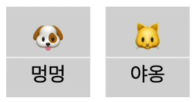

## 리액트 기초 정리

### 컴포넌트

    - 웹사이트를 보면 반복되는 요소 즉, 페이지네이션(1,2,3..), 버튼, 링크, 카드(이미지, 내용, 링크) 이런것들이 컴포넌트 이다.
    - 때에 따라서 컨텐츠만 넘기면 일관적인 UI 를 보여 줄수 있다.
    - 팀 개발시 다른사람이 개발한 컴포너트를 가져다 사용하면 시간 절약 뿐아니라, 웹사이트 전제적으로 일관된 UI 를 가져 갈 수 있다.
    - 카드모양 참고 사이트 : [서핏] https://www.surfit.io/
    - 컨포넌트 참고 사이트 : ant.design 여기에 만들어 놓은 컴포넌트를 가져다 사용하면 된다.
    - 컨포넌트는 React 에서 함수를 사용해서 만들수 있다.
    - 리액트에서 함수에 인자로 넘기는 것을 pros 라고 부른다.
    - 태그 안에 넘긴 props 는 children 으로 넘어 온다.
    - es6+ 의 Destructuring assignment(구조 분해 할당) 을 활용하면 props 를 사용하지 않고 그대로 값을 넘길 수 있다.

Link: [서핏][서핏링크], [ant.design][ant링크]

[서핏링크]: https://www.surfit.io/

[ant링크]: https://ant.design/

```
  ## html에 컨포넌트 코딩 예시
  function Card(titel, desc) { // html 을 반환
    return (
            <div>
              <h2>{title}</h2>
              {desc}
            </div>
    );
  }

  Card('리액트 짱', '리액트 입니다'); //이렇게 호출 할 수있다.
  Card('리액트 싫어요', '리액트 싫어요 입니다');

  <Card title="리액트 짱2" desc="리액트 입니다2"/>  // 리액트가 좋은게 이렇게 호출 가능하다.
  <Card title="리액트 싫어요2" desc="리액트 싫어요 입니다2"/>
```

```
    ## 리액트 함수 인자 예시
    function CatItem(props) {
        console.log(props); 
        // 실제 콘솔에는 
        // {img: 'https://cataas.com//cat/5e9970351b7a400011744233/says/inflearn'}
        // {img: 'https://cataas.com/cat/595f280b557291a9750ebf65/says/JavaScript'}
        // 데이터가 넘어 온다.
         
        return (
            <li>
                 // 넘어온 인자를 받아 처리 한다.
            </li>
        );
    }

    const favorites = (
        <ul className="favorites">
            <CatItem img="https://cataas.com//cat/5e9970351b7a400011744233/says/inflearn"/> // CatItem 컴포넌트에 인자 넘기기
            <CatItem img="https://cataas.com/cat/595f280b557291a9750ebf65/says/JavaScript"/>
        </ul>
    );

```

```
    ## 태그안에 props 로 넘긴 예시
    const Title = (props) => {
        console.log(props);
        // 콘솔로그는 아래 처럼 찍힌다.
        // Object
        //  children: "1번째 고양이 가라사대"
        //      [[Prototype]]: Object
        
        return (
            <h1>{props.children}</h1>
        );
    }
    
    const app = (
        <div>
            <Title>1번째 고양이 가라사대</Title> // 태그안에 props 를 넘긴다.
            {form}
            <MainCard/>
            <Favorites/>
        </div>
    )

```

```
    ## es6+ 의 Destructuring assignment(구조 분해 할당) 예시
    const MainCard = ({img}) => { // props 없이 값을 바로 받음
        return (
            <div className="main-card">
                <CatItem img={img} alt="고양이" width="400"/> // props.img  대신 img 를 바로 사용
                <button>🤍</button>
            </div>
        )
    }
    
    const app = (
        <div>
            <Title>1번째 고양이 가라사대</Title>
            <Title>2번째 고양이 가라사대</Title>
            <Form/>
            <MainCard img="https://cataas.com/cat/60b73094e04e18001194a309/says/react"/> // img 를 props 으로 넘김
            <Favorites/>
        </div>
    )
```

### 스타일링

    - 리액트 에서는 class 대신 className 사용
        - 예) <ul className="favorites">
    - 리액트 에서는 스타일링을 inline 스타일로 한다. 객체로 표현한다.
        - 예)  
    - 최근 리액트 스타일링하는 트렌드
        - emotion 라이브러리 사용 : 아래 링크 참조
            - style prop 를 넘기는 것이 아니가. css prop 을 넘김.
            - styled 컴포넌트 방식 으로 사용가능.
        - Tailwind css 라이브러리 사용.
            - prop 를 넘기는 게 아니라 class 이름을 미리 정의해 놓고 사용한다.

```
    ## Emotion 사용 예시
        1. css prop 넘기기
        import { css } from '@emotion/react'
    
        const color = 'white'
        
        render(
          <div
            css={css`
              padding: 32px;
              background-color: hotpink;
              font-size: 24px;
              border-radius: 4px;
              &:hover {
                color: ${color};
              }
            `}
          >
            Hover to change color.
          </div>
        )
        
        2. Styled 컴포넌트 방식
            import styled from '@emotion/styled'

            const Button = styled.button`
              padding: 32px;
              background-color: hotpink;
              font-size: 24px;
              border-radius: 4px;
              color: black;
              font-weight: bold;
              &:hover {
                color: white;
              }
            `
            
            render(<Button>This my button component.</Button>)
```

Link: [Emotion][Emotion링크], [Tailwind CSS][Tailwind CSS링크]

[Emotion링크]: https://emotion.sh/docs/introduction

[Tailwind CSS링크]: https://tailwindcss.com/

### 이벤트 다루기

    - 이벤트 핸들러의 이름은 handelxxxx 로 네이밍 하는게 리액트 관례 임.

```
    ## 이벤트 예제
    const MainCard = ({img}) => {
        function handelHeartClick() { // onClick 이벤트 핸들러
            console.log("하트 눌렀음");
        }

        function handleHeartMouseOver() { // onMouseOver 이벤트 핸들러
            console.log("하트 스쳐지나감");
        }

        return (
            <div className="main-card">
                <CatItem img={img} alt="고양이"/>
                <button onClick={handelHeartClick} onMouseOver={handleHeartMouseOver}> 🤍</button> // onClick, onMouseOver 이벤트
            </div>
        )
    }
    
    const Form = () => {
        function handleFormSumit(event) { // onSubmit 이벤트 핸들러, 핸들러의 첫번째 파라메터 인자는 event 이다.
            event.preventDefault(); // 폼은 전송되면 브라우져에서 기본적으로 리프레시 함. 이것을 방지하기 위함 코드
            console.log("폼 전송됨");
        }

        return (
            <form onSubmit={handleFormSumit}> // onSubmit 이벤트
                <input type="text" name="name" placeholder="영어 대사를 입력해주세요"/>
                <button type="submit">생성</button>
            </form>
        );
    }
```

### 상태 - useState로 상태 만들기, 상태 끌어올리기

    - 화면에 값을 마음대로 바꾸고 싶을때 상태라는 것을 사용한다. 
    - 그 상태는 리액트의 useState 로 만들고, 또 바꿀 수 있다.

```
    ## useState 예제
    // const counterState = React.useState(1); // useState 의 두번째 인자를 통해 첫번째 인자를 원하는 값을 넘길 수 있다.
    // const counter = counterState[0]; // useState 의 첫번째 인자
    // const setCounter = counterState[1]; // useState 의 두번째 인자
    const [counter, setCounter] = React.useState(1); // 위와 동일한 문법임.

    console.log("카운터", counter);

    function handleFormSumit(event) {
        event.preventDefault();
        console.log("폼 전송됨");
       // setCounter(100); // 두번째 인자 값 세팅
        setCounter(counter + 1);
    }
```

### 상태 끌어 올리기

    - 자식 컴포넌트에서 사용하던 useState 를 다른 곳에서 함께 사용하고 싶을때
        - 부모 컴포넌트에서 그 상태를 끌어 올리고, 그 상태를 자식 컴포넌트에 prop로 넘긴다.

```
## 상태 끌어올리기 예제
    1. 부모를 컴포넌르로 만든다.
        const app = (
                <div>
                    <Title>1번째 고양이 가라사대</Title>
                    <Title>2번째 고양이 가라사대</Title>
                    <Form/>
                    <MainCard img="https://cataas.com/cat/60b73094e04e18001194a309/says/react"/>
                    <Favorites/>
                </div>
            )
            const 여기다가그려 = document.querySelector("#app");
            ReactDOM.render(app, 여기다가그려);
        =>
        const App = () => {
        return (
            <div>
                <Title>{counter}번째 고양이 가라사대</Title>
                <Form/>
                <MainCard img="https://cataas.com/cat/60b73094e04e18001194a309/says/react"/>
                <Favorites/>
            </div>
        );
    }

    const 여기다가그려 = document.querySelector("#app");
    ReactDOM.render(<App/>, 여기다가그려);
    
    2. 자식에 있는 상태 끌어 올리기.
        const Form = () => {
        const [counter, setCounter] = React.useState(1);

        console.log("카운터", counter);

        function handleFormSumit(event) {
            event.preventDefault();
            console.log("폼 전송됨");
            setCounter(counter + 1);
        }

        return (
            <form onSubmit={handleFormSumit}>
                <input type="text" name="name" placeholder="영어 대사를 입력해주세요"/>
                <button type="submit">생성</button>
            </form>
        );
    }
    =>
    const Form = ({handleFormSumit}) => { // 부모에게서 받은 prop 받음
        // useState ~ function handleFormSumit(event) 까지 부모로 옮김.
        return (
            <form onSubmit={handleFormSumit}>
                <input type="text" name="name" placeholder="영어 대사를 입력해주세요"/>
                <button type="submit">생성</button>
            </form>
        );
    }


    const App = () => {
        // 자식 상태를 끌어 올려 옮김. useState ~ function handleFormSumit(event) 까지
        const [counter, setCounter] = React.useState(1);
        console.log("카운터", counter);

        function handleFormSumit(event) {
            event.preventDefault();
            console.log("폼 전송됨");
            setCounter(counter + 1);
        }

        return (
            <div>
                <Title>{counter}번째 고양이 가라사대</Title>
                <Form handleFormSumit={handleFormSumit}/> // 자식에게 prop 로 넘김
                <MainCard img="https://cataas.com/cat/60b73094e04e18001194a309/says/react"/>
                <Favorites/>
            </div>
        );
    } 

```

### 개념 정리 1

    - JSX
        - Javascript + XML
        - Javascript에 HTML 태그를 끼얹은 문법
            - HTML 태그 안에선 중괄호({}) 를 사용해서 JS를 쓸 수 있다.
                - const count = 1;
                - const title = <h1>{count}번째 고양이</h1>
                - 위 title변수에 담은 h1 태그는 리액트 엘리먼트라고 부른다.
    - 리액트 코드 브라우저에 그리기
        - 빈 HTML 공간에 React 때려박기
            - HTML
                - <div id="app"></div>
            - React
                - const target = document.querySelector('#app') // html 을 찾고
                - const myButton = <button>버튼</button> // 리액트 엘리먼트 만듬
                - ReactDOM.render(myButton, target) // 리액트를 사용해서 myButton 을 target 에 그린다.
    - 컴포넌트
        - 여기저기 재사용 가능한 UI 코드 조각
        - 속성을 넘겨서 내부 UI에 디데일 정보를 바꿀수 있다.
        - 아래 멍멍, 야옹 카드uI 를 만들어야 한다고 가정 했을때.
            - 카드 컴포넌트를 만든다.
                - <Card emoji={dog} title="멍멍" /> // emoji 속성은 dog, title 속성은 멍멍 으로 넘김.
                - <Card emoji={cat} title="야옹" /> // emoji 속성은 cat, title 속성은 야옹 으로 넘김.
            -  함수를 통해 컴포넌트를 만든다.
                - function Card(prps) {
                    return (
                        <div>
                            {props.emoji}
                            <h2>{props.title}</h2>
                        </div>)
                  }



    - 스타일링
        - 리액트에 css 끼얹기 (2가지 방법 있음)
            1. CSS 클래스: className
                - <div className="safety">안전</div>
            2. 인라인 스타일링: style={{스타일속성:스타일값}}
                - <div style={{color:'bule'}}>안전</div> // * 주목:  'bule'를 string 로 넘김/
    - 이벤트
        - 사용자 이벤트(클릭, 스크롤 등) 다루기
        - 일반 자바스크립트 이벤트 목록과 동일하지만 중간을 대문자로 쓰면 된다.
            - onclick -> onClick
            - onsubmit -> onSubmit
        - 예제
            - function handleClick(event) {
                console.log("클릭 했습니다");
             }
            <button onClick={handleClick}>제출</button> // button 컴포넌트에 onClick 이벤트를 handleClick 함수를 넘겨 제어한다.
    - 상태
        - 컴포넌트 안에서 자유롭게 변경할 값이 필요할 때 사용
        - useState 함수로 상태를 추가 할 수 있다.
        - const[상태명, 상태변경 함수명] = React.useState(초기값)
        - 컴포넌트 안에서 만들 수 있다.
        - 코드예시
            const[counter, setCounter] = React.useState(1)
            function 카운터증가() {
                setCounter(counter + 1);
            }
            return <button onClick={카운터증가}카운터는 {counter}</button>
    - 리스트
        - 배열로 반복되는 UI 그리기
        - 웹사이트를 만들때 정말 많이 쓴다.
        - 배열에서 map을 돌면서 리액트 UI 를 반환한다.
        - 코드예시
            const favorites = ["이미지1", "이미지2", "이미지3"]
            <ul>
                {favorites.map(image => </img>)}
            <ul>
    - 폼
        - 사용자 입력 다루기
        - 사용자 입력값을 직접 다루기 우해 value를 상태로 관리한다.
        - 코드예시
            const[value, setValue] = React.useState('초기값')
            function onValueChange(e) {
                setValue(e.target.value);
            }
            <form onSubmit={handleSubmit}>
                <input value={value} onChange={onValueChange} />
                <button type="submit">제출</button>
            </form>
    - 로컬스토리지 (리액터 문법 x, 브라우저 기능 o)
        - 브라우저에 데이터 저장하기
        - 간단한 데이터 저장이 필요할 땐 localStorage를 쓰세요.
            * webkit관련 브라우저(애플 > 사파리 등)에서는 7일까지 저장가능
        - 코드예시
            - localStorage.getItem('이름', 'aaa')
            - localStorage.setItem('이름') // aaa

### useEffect

    - 우리가 원하는 시점에 해당 함수를 부르고 싶을때 사용.
    - 예시코드
        const App = () => {
        const CAT1 = "https://cataas.com/cat/60b73094e04e18001194a309/says/react";
        
        const [counter, setCounter] = React.useState(
            jsonLocalStorage.getItem("counter")
        );
        console.log('헬로');
        => App 가 갱신 될때마다 헬로가 찍힌다.
        
        이것을 
        React.useEffect(() => {
            console.log('헬로');
        });
        이렇게 수정하면 그대로 App가 갱신 될때 마다 찍힌다.
        이것을
         React.useEffect(() => {
            console.log('헬로');
        }, []);
        두번째 인자를 사용해서 이 함수가 불리순간을 제한 할 수 있다.
        [] 은 최초 한번만 컴포넌트가 나타날때만 불린다.
        [counter] 는 counter 변수가 변경 될때 마다 불린다.
    - 리액트 컴포넌트 안에 있는 코드는 기본적으로 UI 가 새로 update 될때 마다 계속 불린다.
    - 다만, 계속 불리는 것을 어떤 상태가 바뀔때 마다 불려라고 제한하고 싶을때는 useEffect 의 두번째 인자로 배열을 넘기고, 그곳에 원하는 상태를 넘기면 된다.
    - 상태상관없이 맨처음 한번만 하고 싶다 그러면 빈 배열을 넘기면 된다.

### 참고사항.

    - React 에서 이벤트 핸들러 함수 이름을 지을때 약속된 컨벤션이 있다.
        - handle 라고 시작을 하고, 그 함수를 prop 로  넘긴다고 했을때는 on 이라는 접두어를 붙인다.

```
## 핸들러 이름 붙이기 컨벤션 참조
        function handelHeartClick() {
            setFavorites([...favorites, CAT3]);
        }

        return (
            <div>
                <Title>{counter}번째 고양이 가라사대</Title>
                <Form handleFormSumit={handleFormSumit}/>
                <MainCard img={mainCat} onHeartClick={handelHeartClick}/> // MainCard의 prop 이름은 onHearClick
                <Favorites favorites={favorites}/>
            </div>
        );
```

### 참고 사이트

- [로컬 스토리지 MDN 문서](https://developer.mozilla.org/ko/docs/Web/API/Window/localStorage)
- [git 다운로드 페이지](https://git-scm.com/downloads)
- [팀 개발을 위한 Git, GitHub 입문(강의)]()
- [Public API 리포지토리 주소](https://github.com/public-apis/public-apis)
- [Using Fetch MDN](https://developer.mozilla.org/ko/docs/Web/API/Fetch_API/Using_Fetch)


